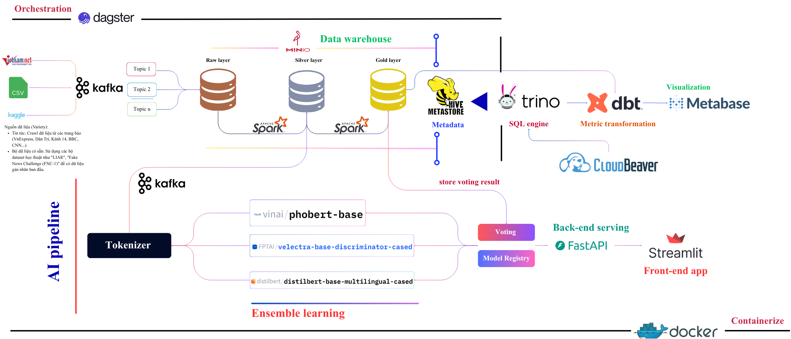

# End-to-End Fake News Detection Platform

This project is a comprehensive, end-to-end platform for detecting fake news. It implements a modern data stack (Lakehouse architecture) and an MLOps pipeline to ingest, process, analyze, and serve predictions on news data.

## Problem Statement

The rapid spread of misinformation poses a significant challenge. This project aims to build a scalable and reliable system that can ingest news articles from various sources, process them in near real-time, and accurately classify them as 'real' or 'fake' using advanced ensemble learning models.

## Architecture

The system is designed as a modular, containerized application orchestrated by Docker Compose. It follows a Data Lakehouse (Medallion) architecture for data processing and an end-to-end MLOps pipeline for machine learning.




## Key Features

* **Real-time Data Ingestion:** Uses **Kafka** to handle streaming data from various sources (CSVs, Kaggle datasets).
* **Data Lakehouse:** Implements a Medallion Architecture (**Raw**, **Silver**, **Gold** layers) on **MinIO** for scalable object storage.
* **Large-Scale Processing:** Leverages **Apache Spark** for transforming data between lake layers.
* **Centralized Metadata:** Uses **Hive Metastore** to manage schemas for the data lake.
* **High-Performance Querying:** Employs **Trino** as the query engine to analyze data directly from MinIO.
* **Metric Transformation:** Uses **dbt** for robust, SQL-based metric and business logic transformations on the Gold layer.
* **Advanced AI/ML:**
    * Features an **Ensemble Learning** pipeline using a Voting classifier.
    * Combines three powerful transformer models: `phobert-base`, `velectra-base-discriminator-cased`, and `distilbert-base-multilingual-cased`.
    * Includes a **Model Registry** for versioning and managing ML models.
* **Orchestration:** All data and AI pipelines are orchestrated and monitored by **Dagster**.
* **Visualization & UI:**
    * **Metabase** provides BI dashboards and visualizations by querying Trino.
    * **Streamlit** serves as the front-end application for user interaction.
* **Containerization:** The entire stack is containerized with **Docker** and managed via **Docker Compose** for easy setup and portability.

## Technology Stack

| Category | Technology |
| :--- | :--- |
| **Orchestration** | Dagster |
| **Data Ingestion** | Kafka |
| **Data Lake Storage** | MinIO |
| **Data Processing** | Apache Spark |
| **Query Engine** | Trino (formerly PrestoSQL) |
| **Metadata Store** | Hive Metastore |
| **Transformation** | dbt (Data Build Tool) |
| **ML Pipeline** | Hugging Face Transformers, scikit-learn |
| **Visualization** | Metabase |
| **Front-end App** | Streamlit |
| **Database Admin** | CloudBeaver |
| **Containerization** | Docker, Docker Compose |

## How It Works: Pipeline Overview

The system is divided into two main pipelines, both orchestrated by Dagster:

### 1. Data Warehouse Pipeline (ELT)

1.  **Ingest:** Data sources (CSVs, etc.) are streamed into **Kafka** topics.
2.  **Land (Raw):** A Spark job consumes from Kafka and lands the raw, unchanged data into the **Raw Layer** in MinIO.
3.  **Process (Silver):** Another Spark job reads from the Raw Layer, applies cleaning, deduplication, and standardization, and saves the result to the **Silver Layer**.
4.  **Enrich (Gold):** A final Spark job (or dbt model) aggregates data, joins it with other sources, and creates the analysis-ready **Gold Layer**.
5.  **Query:** **Trino** uses the **Hive Metastore** to query this data across all layers. **dbt** builds final metric tables on the Gold layer.

### 2. AI Pipeline (MLOps)

1.  **Trigger:** A Kafka topic (or a Dagster schedule) triggers the AI pipeline.
2.  **Tokenize:** Input text data is passed through a **Tokenizer**.
3.  **Ensemble Predict:** The tokens are fed into the three parallel transformer models (PhoBERT, Electra, DistilBERT).
4.  **Vote:** A **Voting** mechanism combines the three predictions to produce a final, more robust classification (real/fake).
5.  **Store Result:** The final prediction (**"store voting result"**) is written back into the **Gold Layer** of the Data Warehouse.
6.  **Analyze:** With the predictions now in the Gold Layer, **Metabase** and **Streamlit** can query them via Trino to display results and insights.

## Getting Started

### Prerequisites

Before you begin, ensure you have the following installed on your system:

* **Docker** (version 20.10 or higher): [Download Docker](https://www.docker.com/get-started)
* **Docker Compose** (version 2.0 or higher): [Install Docker Compose](https://docs.docker.com/compose/install/)
* **Git**: For cloning the repository
* **Minimum System Requirements:**
  * RAM: 8GB (16GB recommended)
  * Disk Space: 20GB free space
  * CPU: 4 cores (8 cores recommended)

### Installation & Setup

Follow these steps to set up and run the project:

#### 1. Clone the Repository

```bash
git clone https://github.com/MinhTuan2405/EnsemTrust.git
cd EnsemTrust
```

#### 2. Configure Environment Variables

Create a `.env` file from the example template:

**On Windows (PowerShell):**
```powershell
Copy-Item .example.env .env
```

**On Linux/macOS:**
```bash
cp .example.env .env
```

**Optional:** Edit the `.env` file to customize the configuration (ports, credentials, etc.). The default values are:
- **PostgreSQL:** Port `5433`, User `admin`, Password `admin123`
- **MinIO:** Port `9000` (API) and `9001` (Console), Credentials `admin/admin123`
- **Dagster:** Port `3001`
- **Trino:** Port `8090`
- **Metabase:** Port `3007`
- **Streamlit:** Port `8501`
- **Kafka UI:** Port `8088`
- **CloudBeaver:** Port `8978`

#### 3. Download Required JAR Files

The project requires specific JAR files for Hadoop, PostgreSQL, and AWS SDK integration. Run the appropriate script for your OS:

**On Windows (PowerShell):**
```powershell
.\jardownloader.ps1
```

**On Linux/macOS:**
```bash
chmod +x jardownloader.sh
./jardownloader.sh
```

This will download the following JARs to the `./jars` directory:
- `hadoop-aws-3.3.6.jar`
- `postgresql-42.7.8.jar`
- `aws-java-sdk-bundle-1.12.262.jar`

#### 4. Build and Start All Services

Use Docker Compose to build and start all containers:

**Option A: Using Make (if available):**
```bash
make build_run_all
```

**Option B: Using Docker Compose directly:**
```bash
docker compose up -d --build
```

This command will:
- Build custom Docker images (Dagster, Streamlit)
- Pull required images from Docker Hub
- Create and start all containers in detached mode
- Set up networks and volumes
- Initialize databases and create MinIO buckets (bronze, silver, gold)

#### 5. Verify Services are Running

Check that all containers are running properly:

```bash
docker compose ps
```

You should see all services in the "Up" or "running" state. You can also check the logs:

```bash
# View logs for all services
docker compose logs

# View logs for a specific service
docker compose logs dagster
docker compose logs trino
```

#### 6. Wait for Services to Initialize

Some services may take a few minutes to fully initialize:
- **Trino**: Wait for the healthcheck to pass (~1-2 minutes)
- **Metabase**: First startup may take 2-3 minutes to initialize the database
- **Hive Metastore**: Should connect to PostgreSQL and initialize schemas

You can monitor the initialization progress:

```bash
docker compose logs -f hive-metastore
docker compose logs -f trino
docker compose logs -f metabase
```

### Common Setup Commands

The project includes a `Makefile` with convenient commands:

```bash
# Start all services
make up

# Stop all services
make down

# Restart all services
make restart

# Rebuild images
make build

# Build and run all services
make build_run_all
```

## Usage

Once all containers are running, you can access the different services:

* **Dagster UI (Orchestration):** `http://localhost:3000`
* **Streamlit App (Front-end):** `http://localhost:8501`
* **Metabase (BI Dashboard):** `http://localhost:3030`
* **MinIO Console (Data Lake):** `http://localhost:9001`
* **CloudBeaver (DB Admin):** `http://localhost:8978`
* *(Note: Ports may vary based on your `docker-compose.yml` configuration.)*

## Future Work

* **Model Serving API:** Implement a dedicated API (e.g., using FastAPI) to serve the model from the Model Registry for real-time, on-demand predictions in Streamlit.
* **Automated Retraining:** Build a Dagster pipeline that periodically retrains the ensemble model on new data from the Gold Layer.
* **Web Scraper:** Integrate a web scraping component (e.g., Scrapy) to continuously feed new articles into the Kafka pipeline.